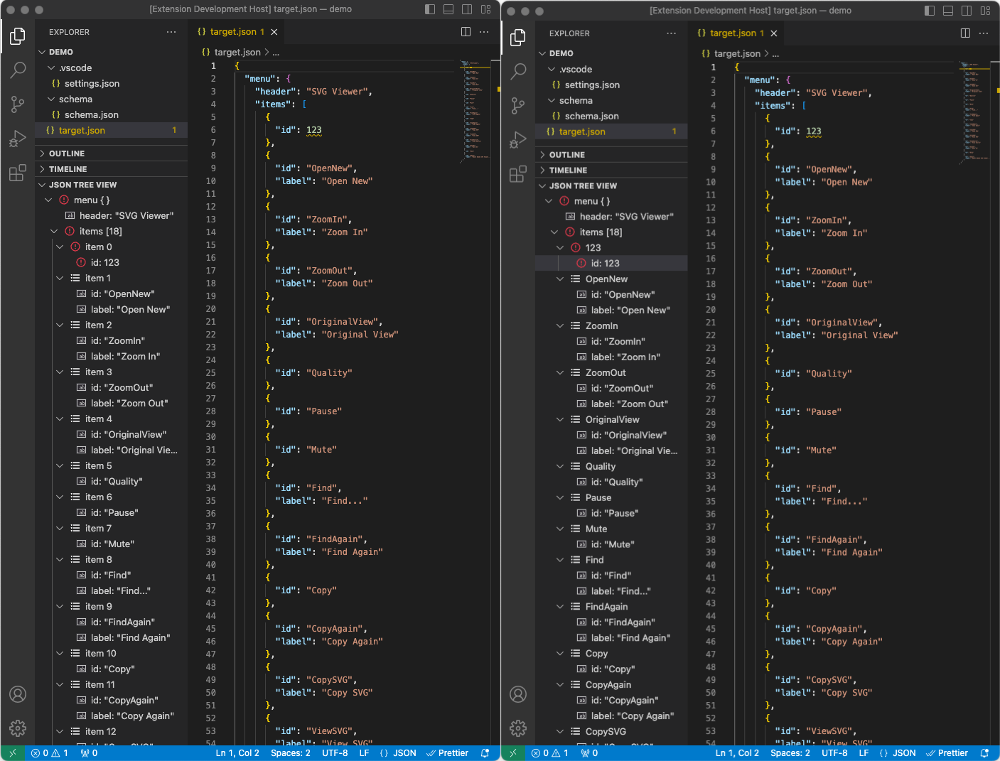
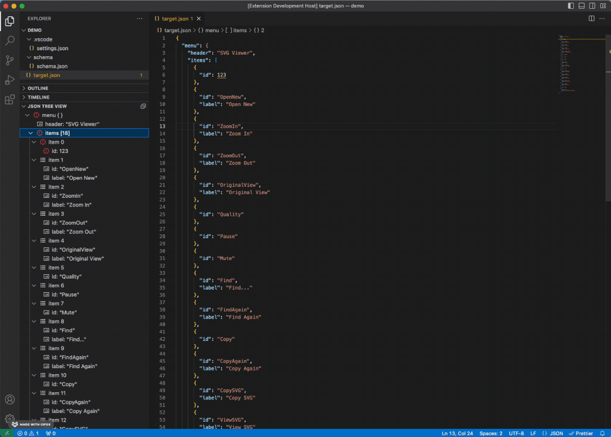

# JSON Tree View

A tool to generate JSON tree view from JSON file, integrated with JSON schema validation and customized tree view configuration.



## Features

* JSON Tree View
* Validation Error Hightlighting
* Customized Tree View Configuration

## How to run

1. Follow instructions on `https://code.visualstudio.com/docs/languages/json` to set up json schema files.
2. To enable customized tree view, in user setting you need to specify the key of the object you want to customize and speicify which children's key you want to use as identifier. E.g. 

    ```
    {
        "jsonTreeView.customizedViewMapping": {
            "items": "id"
        }
    }
    ```

## Quick Demo
Open folder `./demo` in Visual Studio Code, and open file `target.json` in text editor, you will find errors are highlighted.

## Release Notes

### 1.0.0

Initial release of JSON Tree View

### 2.0.0

Remove ajv library and use vscode diagnostics API instead

### 3.0.0

Refine `Reveal` and `Reveal with Key`. 

Add `Reveal in Tree` to highlight tree node from text editor.



## Others
* For more information, feel free to raise new issues on [Github Repository JSON Tree View](https://github.com/ChaunceyKiwi/json-tree-view)
